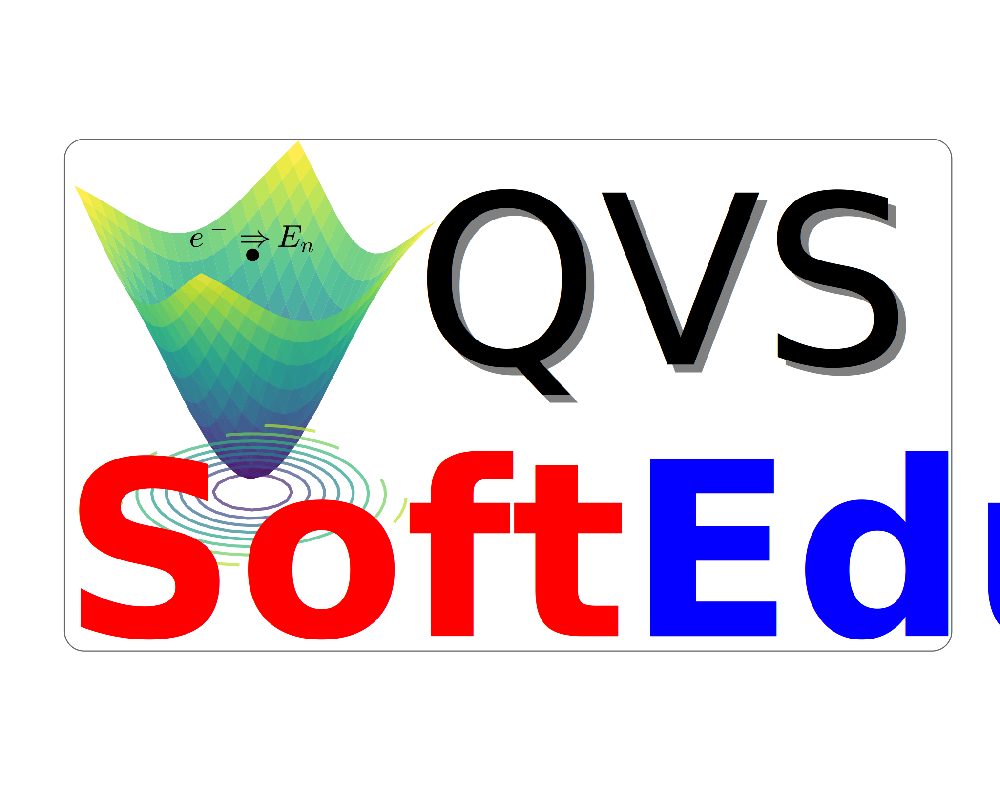

# QVS (Quantum Variational Software)

**QVS** is an educational tool designed to support the teaching of the variational method in quantum mechanics, focusing on confined quantum states, including both ground and excited states. It offers a graphical and interactive environment to explore how variational parameters affect wavefunctions and energy levels. To run QVS properly, you need to have the following installed: `git`, `python3`, `python3-tk`, `python3-matplotlib`, `python3-numpy`, and `python3-scipy`.

  

